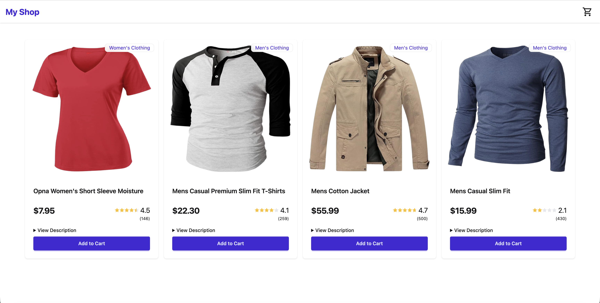
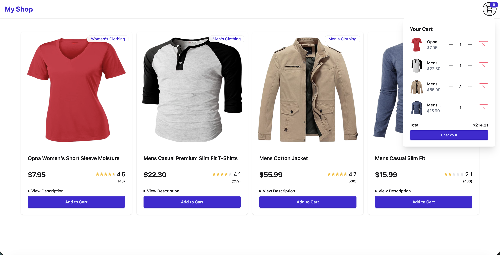
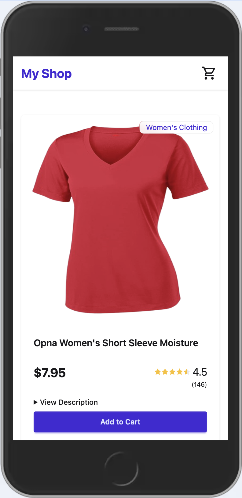

# Shopping App

A React project which combines reducers with context in order to create a simple shopping application.

---

## Table of Contents

- [Installation](#installation)  
- [App Overview](#app-overview)
- [Lighthouse Performance](#lighthouse-performance)

---

## Installation
In order to set up and run the project on your local device, make use of the following commands in your terminal:

1. Clone the repository:

```bash
git clone https://github.com/DVT-Grad-Projects-Mihir-Arjun/shopping-cart.git
```

2. Install dependencies using:
```bash
npm install
```

3. Start the development server by running:
```bash 
npm run dev
```

4. In your terminal you will see a message telling you at which URL you may access the application. The below is an example:
```bash
> movies@0.0.0 dev
> vite

Port 5173 is in use, trying another one...

  VITE v7.3.1  ready in 1521 ms

  ➜  Local:   http://localhost:5174/
  ➜  Network: use --host to expose
  ➜  press h + enter to show help
```
In the above example you can see that the app is viewable at http://localhost:5174/ (the port number in the URL may vary)

## App Overview
### Shopping
When you first open the website you will see the following:



As you can see above that below each item you have the option to add the item to your shopping cart. Below you can see what happens when you click on your shopping cart in the top right:



As you can see, you can adjust the quantity of a specific item or you can remove it from your cart completely. The total price is also displayed and finally there is a checkout option.

### Mobile Responsiveness
This application has been designed with mobile responsiveness in mind and this can be seen below:




### Lighthouse Performance
We were asked to ensure that our application is in the green for every category which Lighthouse provides and the performance of this app can be seen below:


